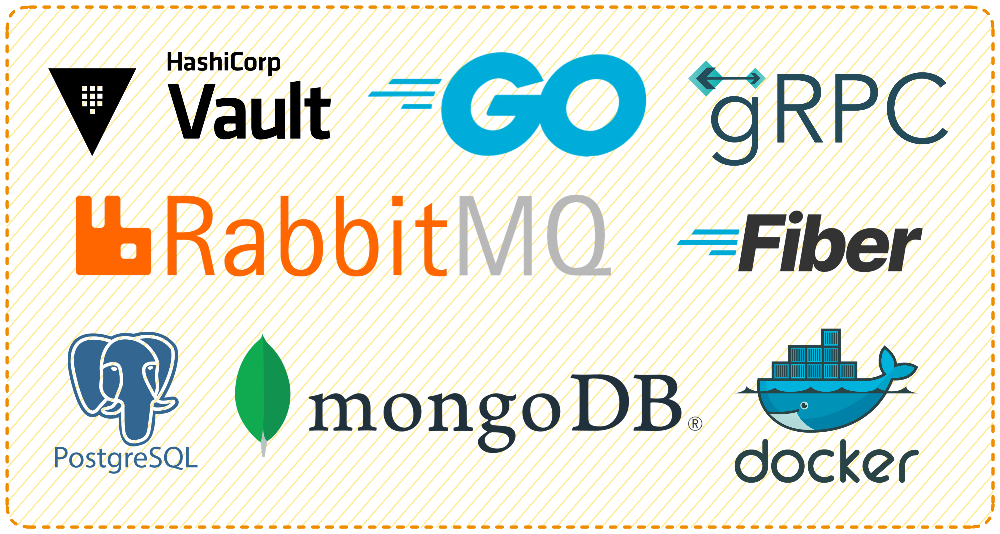

# 📰 Content Publisher - Backend Microservices

Sistem backend ini dibangun menggunakan arsitektur microservices untuk aplikasi Content Publisher. Artikel dikirim oleh pengguna dalam bentuk HTML (WYSIWYG), disimpan, dan dimoderasi secara otomatis.

# 🔌 Teknologi
- Go (Golang)
- gRPC
- PostgreSQL
- MongoDB
- RabbitMQ
- Docker & Docker Compose
- Vault

# 🤖Exposed Ports

| Service Name        | Container Name      | Port (Host\:Container) | Keterangan                                                   |
|---------------------|---------------------|------------------------|--------------------------------------------------------------|
| `vault`             | `vault-dev`         | `8200:8200`            | Vault dev UI dan API                                         |
| `rabbitmq-server`   | `rabbitmq-server`   | `5672:5672`            | AMQP (RabbitMQ message broker)                               |
|                     |                     | `15672:15672`          | RabbitMQ management UI                                       |
| `postgres-server`   | `postgres-server`   | `5432:5432`            | PostgreSQL default port                                      |
| `mongodb-server`    | `mongodb`           | `27017:27017`          | MongoDB default port                                         |
| `vault-init`        | `vault-init`        | *(tidak exposed)*      | Container init satu kali jalan (init script)                 |
| `gateway-srv`       | `auth-srv`          | `8000:8000`            | External-only, expose port ke host sebagai base url REST API |
| `auth-srv`          | `auth-srv`          | *(tidak exposed):8001* | Internal-only, tidak expose port ke host                     |
| `article-srv`       | `article-srv`       | *(tidak exposed):8002* | Internal-only, tidak expose port ke host                     |
| `moderation-srv`    | `moderation-srv`    | *(tidak exposed):8003* | Internal-only, tidak expose port ke host                     |
| `moderation-worker` | `moderation-worker` | *(tidak exposed)*      | Internal-only, tidak expose port ke host                     |
| `article-worker`    | `article-worker`    | *(tidak exposed)*      | Internal-only, tidak expose port ke host                     |

# ⚙️ Setup Guide

Panduan ini berisi langkah demi langkah untuk menjalankan sistem Posfin Blog secara lokal menggunakan Docker. Di dalamnya terdapat instruksi mulai dari cloning repository, konfigurasi environment, hingga menjalankan seluruh service.

👉 Silakan baca file [setup-guide.md](./docs/setup-guide.md) untuk informasi lengkap.

# 🏗️ Architecture

Posfin Blog menggunakan pendekatan microservices architecture yang terdiri dari beberapa service terpisah, seperti authentication, article, moderation, dan lainnya. Setiap service berkomunikasi melalui gRPC, dan dikelola melalui API Gateway berbasis REST.

Struktur arsitektur ini dirancang untuk skalabilitas, modularitas, dan kemudahan pengembangan.

👉 Lihat detail lengkapnya di file [architecture.md](./docs/architecture.md).